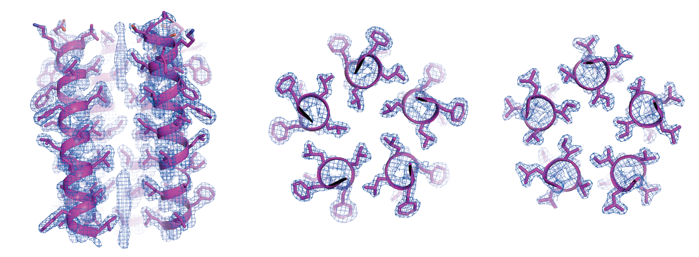

   Hello World.  We are hosted in the [Department of Integrative Structural and Computational Biology](https://www.scripps.edu/science-and-medicine/research-departments/integrative-structural-and-computational-biology/) at [The Scripps Research Institute](https://www.scripps.edu/) on the sunny seaside La Jolla, California campus. 
{: .welcomefont}
 

 

 
   We use protein design and integrative computational approaches to challenge our understanding of biomolecular structure, function, and physical chemistry.  
 
   We study the complex molecular features of transmembrane domains and thier active roles in natural and disease-causing biological processes.  Our research focuses on data-driven design of synthetic membrane proteins as simple model molecules to ask fundamental biophysical questions and engineering custom chemical biology tools targeting proteins directly at their lipid-embedded regions.  
{: .welcomefont}
